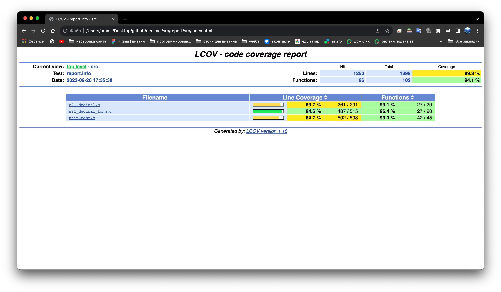

Собственная реализация библиотеки s21_decimal.h.

## Содержание
1. [Вступление](https://github.com/Aramil326/decimal#%D0%B2%D1%81%D1%82%D1%83%D0%BF%D0%BB%D0%B5%D0%BD%D0%B8%D0%B5)
2. [Информация](https://github.com/Aramil326/decimal#%D0%B8%D0%BD%D1%84%D0%BE%D1%80%D0%BC%D0%B0%D1%86%D0%B8%D1%8F)
3. [Part 1. Задание](https://github.com/Aramil326/decimal#part-1-%D0%B7%D0%B0%D0%B4%D0%B0%D0%BD%D0%B8%D0%B5)
4. [Part 2. Использование](https://github.com/Aramil326/decimal#part-2-%D0%B8%D1%81%D0%BF%D0%BE%D0%BB%D1%8C%D0%B7%D0%BE%D0%B2%D0%B0%D0%BD%D0%B8%D0%B5)
5. [Результаты тестов](https://github.com/Aramil326/decimal#%D1%80%D0%B5%D0%B7%D1%83%D0%BB%D1%8C%D1%82%D0%B0%D1%82%D1%8B-%D1%82%D0%B5%D1%81%D1%82%D0%BE%D0%B2)


## Вступление

В данном проекте требуется создать библиотеку s21_decimal.h на языке программирования C. Эта библиотека добавит функциональность для работы с типом данных "decimal", отсутствующим в стандартном языке C. Тип "decimal" имеет особое значение в финансовых вычислениях, где точность очень важна, и не допускается погрешности, которые могут возникнуть при использовании типов данных с плавающей точкой. В ходе выполнения проекта, вы будете знакомиться с задачами обработки финансовой информации, изучать внутреннее представление различных типов данных и применять структурный подход к решению задачи.

## Информация

Тип `Decimal` предназначен для представления десятичных чисел, которые могут находиться в диапазоне от положительных 79,228,162,514,264,337,593,543,950,335 до отрицательных 79,228,162,514,264,337,593,543,950,335. По умолчанию, значение переменной типа `Decimal` равно 0. Этот тип данных особенно подходит для финансовых расчетов, в которых требуется большая точность как для целых, так и для дробных значений, и при этом не допускается ошибок округления. Важно отметить, что тип `Decimal` не исключает округления, но снижает вероятность возникновения ошибок из-за округления до минимума.  

При передаче результата операций деления и умножения на метод округления, сохраняется точность результата.  

Число типа `Decimal` представляет собой значение с плавающей точкой, состоящее из следующих компонентов: знака, числовой части, где каждая цифра находится в интервале от 0 до 9, и коэффициента масштабирования, который определяет положение десятичной точки, разделяющей целую и дробную части числа.  

Двоичное представление числа типа `Decimal` включает в себя следующие компоненты: один бит для обозначения знака, 96 бит для представления целой части числа, и коэффициент масштабирования, который используется для разделения 96-битной целой части на целую и десятичную части. Коэффициент масштабирования неявно задается как число 10, возведенное в степень в диапазоне от 0 до 28. Таким образом, двоичное представление числа типа `Decimal` можно представить как ((от -2^96 до 2^96) / 10^(от 0 до 28)), где минимальное значение соответствует -(2^96-1), а максимальное значение - 2^96-1.  

Коэффициент масштабирования в числе типа `Decimal` может включать в себя конечные нули, и эти нули не влияют на значение при выполнении арифметических операций или операций сравнения. То есть, наличие или отсутствие конечных нулей в коэффициенте масштабирования не изменяет результат вычислений или сравнений, и они остаются эквивалентными.  

### Двоичное представление  

Двоичное представление числа типа `Decimal` включает в себя следующие компоненты: один бит для обозначения знака, 96 бит для представления целой части числа и коэффициента масштабирования, который используется для деления целой части числа и указывает, какая его часть является десятичной дробью. Коэффициент масштабирования неявно равен числу 10, возведенному в степень в диапазоне от 0 до 28.  

Число типа `Decimal` может быть представлено в виде четырехэлементного массива 32-разрядных целых чисел со знаком, что соответствует `int bits[4];`. Каждый элемент массива представляет часть числа в двоичной форме, и такое представление позволяет работать с числами большой точности и диапазона.

`bits[0]`, `bits[1]` и `bits[2]` представляют младшие, средние и старшие 32 бита 96-разрядного целого числа соответственно. Это трехэлементное представление целой части числа типа `Decimal`.

`bits[3]` включает в себя коэффициент масштабирования и знак числа и разбивается на следующие части:
- Биты с 0 по 15 (младшее слово) не используются и должны быть равны нулю.
- Биты с 16 по 23 содержат значение показателя степени в диапазоне от 0 до 28, что определяет степень десяти, используемую для разделения целой части числа.
- Биты с 24 по 30 также не используются и должны быть установлены в ноль.
- Бит 31 используется для обозначения знака числа: 0 обозначает положительное число, а 1 - отрицательное.


### Пример:

```c
typedef struct 
{
    int bits[4];
} s21_decimal;
```

### Арифметические операторы

| Название оператора | Оператор  | Функция                                                                            | 
| ------ | ------ |------------------------------------------------------------------------------------|
| Сложение | + | int s21_add(s21_decimal value_1, s21_decimal value_2, s21_decimal *result)         |
| Вычитание | - | int s21_sub(s21_decimal value_1, s21_decimal value_2, s21_decimal *result)         |
| Умножение | * | int s21_mul(s21_decimal value_1, s21_decimal value_2, s21_decimal *result) | 
| Деление | / | int s21_div(s21_decimal value_1, s21_decimal value_2, s21_decimal *result) |
| Остаток от деления | Mod | int s21_mod(s21_decimal value_1, s21_decimal value_2, s21_decimal *result) |

Функции возвращают код ошибки:  
- 0 - OK  
- 1 - число слишком велико или равно бесконечности
- 2 - число слишком мало или равно отрицательной бесконечности
- 3 - деление на 0

*Уточнение про числа, не вмещающиеся в мантиссу:*
- *При получении чисел, не вмещающихся в мантиссу при арифметических операциях, использовать банковское округление (например, 79,228,162,514,264,337,593,543,950,335 - 0.6 = 79,228,162,514,264,337,593,543,950,334)*

*Уточнение про операцию mod:*
- *Если в результате операции произошло переполнение, то необходимо отбросить дробную часть (например, 70,000,000,000,000,000,000,000,000,000 % 0.001 = 0.000)*


### Операторы сравнение

| Название оператора | Оператор  | Функция | 
| ------ | ------ | ------ |
| Меньше  | < | int s21_is_less(s21_decimal, s21_decimal) |
| Меньше или равно | <= | int s21_is_less_or_equal(s21_decimal, s21_decimal) | 
| Больше | \> |  int s21_is_greater(s21_decimal, s21_decimal) |
| Больше или равно | \>= | int s21_is_greater_or_equal(s21_decimal, s21_decimal) | 
| Равно | == |  int s21_is_equal(s21_decimal, s21_decimal) |
| Не равно | != |  int s21_is_not_equal(s21_decimal, s21_decimal) |

Возвращаемое значение:
- 0 - FALSE
- 1 - TRUE

### Преобразователи 

| Преобразователь | Функция | 
| ------ | ------ |
| Из int | int s21_from_int_to_decimal(int src, s21_decimal *dst) |
| Из float  | int s21_from_float_to_decimal(float src, s21_decimal *dst) |
| В int  | int s21_from_decimal_to_int(s21_decimal src, int *dst) |
| В float  | int s21_from_decimal_to_float(s21_decimal src, float *dst) |

Возвращаемое значение - код ошибки:
 - 0 - OK
 - 1 - ошибка конвертации

*Уточнение про преобразование числа типа float:*
- *Если числа слишком малы (0 < |x| < 1e-28), вернуть ошибку и значение, равное 0*
- *Если числа слишком велики (|x| > 79,228,162,514,264,337,593,543,950,335) или равны бесконечности, вернуть ошибку*
- *При обработке числа с типом float преобразовывать все содержащиеся в нём значимые десятичные цифры. Если таких цифр больше 7, то значение числа округляется к ближайшему, у которого не больше 7 значимых цифр.*

*Уточнение про преобразование из числа типа decimal в тип int:*
- *Если в числе типа decimal есть дробная часть, то её следует отбросить (например, 0.9 преобразуется 0)*


### Другие функции

| Описание | Функция                                                  | 
| ------ |----------------------------------------------------------|
| Округляет указанное Decimal число до ближайшего целого числа в сторону отрицательной бесконечности. | int s21_floor(s21_decimal value, s21_decimal *result)    |	
| Округляет Decimal до ближайшего целого числа. | int s21_round(s21_decimal value, s21_decimal *result)    |
| Возвращает целые цифры указанного Decimal числа; любые дробные цифры отбрасываются, включая конечные нули. | int s21_truncate(s21_decimal value, s21_decimal *result) |
| Возвращает результат умножения указанного Decimal на -1. | int s21_negate(s21_decimal value, s21_decimal *result)   |

Возвращаемое значение - код ошибки:
 - 0 - OK
 - 1 - ошибка вычисления


## Part 1. Задание

Для выполнения данного задания соблюдаем следующие требования:

- Разрабатываем библиотеку на языке программирования C, с учетом стандарта C11, и используем компилятор GCC.
- Располагаем код библиотеки в директории "src" в ветке "develop".
- Избегаем использования устаревших и выведенных из употребления конструкций языка и библиотечных функций, следя за пометками "legacy" и "obsolete" в официальной документации по языку и библиотекам. Ориентируемся на стандарт POSIX.1-2017.
- При написании кода соблюдаем стиль оформления, соответствующий Google Style.
- Создаем статическую библиотеку и включаем в нее заголовочный файл "s21_decimal.h".
- Разрабатываем библиотеку в соответствии с принципами структурного программирования.
- Добавляем префикс "s21_" перед каждой функцией.
- Обеспечиваем полное покрытие юнит-тестами для всех функций библиотеки с использованием библиотеки Check, где каждая функция покрывается не менее чем 80% тестов.
- Предусматриваем наличие Makefile для удобной сборки библиотеки и тестов, включая цели "all", "clean", "test", "s21_decimal.a" и "gcov_report".
- В цели "gcov_report" формируем отчет по кодовому покрытию с использованием инструмента gcov в виде HTML-страницы. Для этого unit-тесты запускаются с соответствующими флагами для gcov.
- Не используем тип данных __int128.
- Возможно оставлять или удалять конечные нули (за исключением функции `s21_truncate`).
- Обеспечиваем поддержку чисел в диапазоне от -79,228,162,514,264,337,593,543,950,335 до +79,228,162,514,264,337,593,543,950,335 для определенного типа данных.

## Part 2. Использование

<u> Все команды выполняются из директории src в терминале</u>  

Очищает объектные и прочие файлы, полученные во время выполнения других целей, и собирает статическую библиотеку:
```makefile
make all
```

Собирает статическую библиотеку:
```makefile
make s21_decimal.a
```

Запускает сборку тестов:
```makefile
make test
```

Запускает проверку покрытия тестов и создание отчета:
```makefile
make gcov_report
```

Очищает объектные и прочие файлы, полученные во время выполнения других целей:
```makefile
make clean
```

## Результаты тестов

Покрытие тестов:

